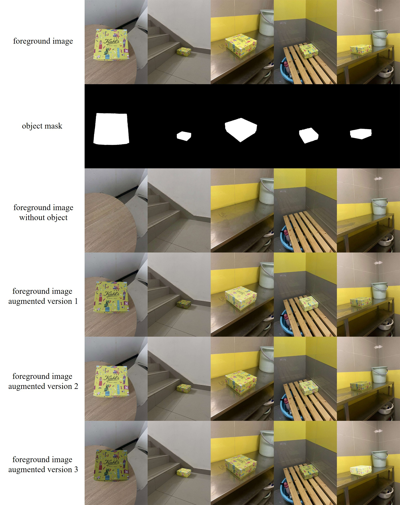

# Image-Composition-Dataset-MureCom
Comprehensive Dataset for Image Composition &amp; Object Insertion


Our MureCom dataset can be downloaded from [[Dropbox]](https://www.dropbox.com/scl/fi/0loo3934w5787s9tvus9i/MureCom.zip?rlkey=jzwby2b41qlr450myijeeai18&st=vg02b0k9&dl=0) or [[Baidu Cloud]](https://pan.baidu.com/s/1qPU6FWVuqXOVEHEZETip2A?pwd=u3wi). Note that MureCom is extended from our previous [FOSCom](https://github.com/bcmi/ControlCom-Image-Composition/tree/main?tab=readme-ov-file#foscom-dataset) dataset. This folder consists of 32 category subfolders, where each subfolder contains the following data:

- **Backgrounds**: Each subfolder includes 20 background images suitable for that category. These background images are stored in the `bg` folder together with their bounding boxes to insert the foreground object.
- **Foregrounds**: Each subfolder includes 3 sets of foreground images, in which each set contains 5 images for the same foreground object. Three sets of foreground images are stored in the `fg1`, `fg2`, and `fg3` folders together with their masks, bounding box masks, variants without object, variants with different object lighting.  

```
MureCom
├── Airplane
│   └── bg
│       ├── 0.jpg                      # background image
│       ├── 0_bbox.png                 # bbox mask to insert object
│       │── ....   
│   └── fg1
│       ├── 0.jpg                      # foreground image
│       ├── 0.png                      # object mask
│       ├── 0_bbox.png                 # object bbox mask
│       ├── 0_rmobj.jpg                # foreground image after removing object
│       └── 0_aug                      # augmented foreground images by varying object lighting
├          │── 0.jpg  
│          │── 1.jpg 
│          │── ....   
│       │── ....
│   └── ....
├── Bird
│── ....
```

By taking "fg3" from "Box" category as an example, we show foreground images, object masks, foreground images after removing objects, augmented foreground images by varying object lighting below. 

<p align='center'>  
  
</p>

