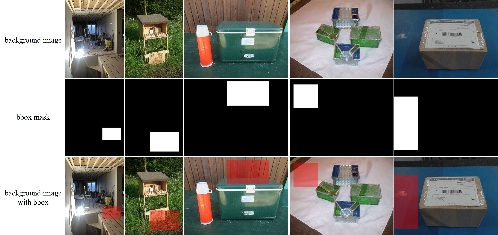

## Image-Composition-Dataset-MureCom

To support fine-tuning open-source foundation image editing model for varied image composition and object insertion tasks, we built the maximally comprehensive dataset MureCom with ongoing improvements. The term "comprehensive" here does not refer to dataset scale, but rather the diversity of data types.

Our MureCom dataset can be downloaded from [[Dropbox]](https://www.dropbox.com/scl/fi/aj7mhb46zo18w09k43k74/MureCom.zip?rlkey=ixd3z3ccg7c1yq41fxwlqyou2&st=35pmz99i&dl=0) or [[Baidu Cloud]](https://pan.baidu.com/s/1qPU6FWVuqXOVEHEZETip2A?pwd=u3wi). Note that MureCom is extended from our previous [FOSCom](https://github.com/bcmi/ControlCom-Image-Composition/tree/main?tab=readme-ov-file#foscom-dataset) dataset. This folder consists of 32 category subfolders, where each subfolder contains the following data:

- **Backgrounds**: Each subfolder includes 20 background images suitable for that category. These background images are stored in the `bg` folder together with their bounding boxes to insert the foreground object.
- **Foregrounds**: Each subfolder includes 3 sets of foreground images, in which each set contains 5 images for the same foreground object. Three sets of foreground images are stored in the `fg1`, `fg2`, and `fg3` folders together with their masks, bounding box masks, variants without object, variants with different object lighting.  

```
MureCom
├── Airplane
│   └── bg
│       ├── 0.jpg                      # background image
│       ├── 0_bbox.png                 # bbox mask to insert object
│       │── ....   
│   └── fg1
│       ├── 0.jpg                      # foreground image
│       ├── 0.png                      # object mask
│       ├── 0_bbox.png                 # object bbox mask
│       ├── 0_rmobj.jpg                # foreground image after removing object
│       └── 0_aug                      # augmented foreground images by varying object lighting
├          │── 0.jpg  
│          │── 1.jpg 
│          │── ....   
│       │── ....
│   └── ....
├── Bird
│── ....
```

By taking "bg" from "Box" category as an example, we show background images, bounding box masks (plausible bounding box to insert a foreground object of "Box" category), background images covered with bounding boxes below. 

<p align='center'>  
  
</p>


By taking "fg3" from "Box" category as an example, we show foreground images, object masks, foreground images after removing objects and their reflections/shadows, augmented foreground images by varying object lighting below. 

<p align='center'>  
  
</p>


## Online Demo

Try this [online demo](http://libcom.ustcnewly.com/) for image composition (object insertion) built upon [libcom](https://github.com/bcmi/libcom) toolbox and have fun!

[![]](https://github.com/user-attachments/assets/87416ec5-2461-42cb-9f2d-5030b1e1b5ec)

## Other Resources

+ Similar datasets: [Awesome-Generative-Image-Composition#Datasets](https://github.com/bcmi/Awesome-Generative-Image-Composition#Datasets)
+ We summarize the papers and codes of image composition from all aspects: [Awesome-Image-Composition](https://github.com/bcmi/Awesome-Object-Insertion)
+ We summarize all possible evaluation metrics to evaluate the quality of composite images:  [Composite-Image-Evaluation](https://github.com/bcmi/Composite-Image-Evaluation)
+ We write a comprehensive on image composition: [the 3rd edition](https://arxiv.org/abs/2106.14490)


